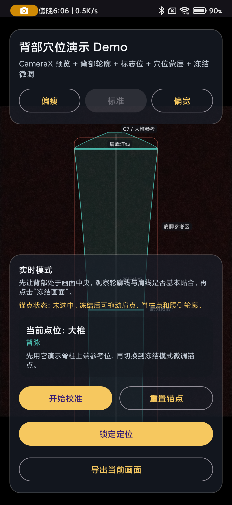

# Human Back Acupoint Demo



一个面向`理疗机器人 / 康复设备能力展示`的 Android 原生 Demo。  
An Android native demo for `rehab robot / wellness device capability presentation`.

这不是临床级自动定穴系统，也不是已经接好真实设备协议的成品。它当前展示的是一条更适合 PoC 和方案演示的链路：`背部预览 -> 手动轮廓定位 -> 穴位映射 -> JSON 输出 -> 模拟设备接收`。  
This is not a clinical-grade acupoint localization system and not a production robot-control app. It demonstrates a practical PoC flow: `back preview -> manual contour alignment -> acupoint mapping -> JSON export -> simulated device receiving`.

## Positioning / 项目定位

适合：

- 客户演示
- 方案路演
- 理疗机器人前端交互原型
- 背部穴位视觉链路的第一阶段 PoC

Good for:

- customer demos
- solution presentations
- rehab robot UI prototyping
- first-stage PoC for back acupoint visualization

不适合直接作为：

- 医疗产品
- 临床落点工具
- 真实机器人控制终版

Not intended as:

- a medical product
- a clinical localization tool
- a final robot control system

## Features / 当前能力

- `CameraX` 后摄实时预览 / rear-camera live preview
- 固定背部轮廓模板 / fixed back contour template
- 三种体型模板：`偏瘦 / 标准 / 偏宽` / three body templates
- 三步定位流程：肩线、脊柱中线、腰侧胖瘦 / 3-step alignment flow
- 六个可拖拽锚点 / six draggable anchors
- 锁定后显示背部穴位 / acupoint overlay after lock
- 当前点位说明卡片 / selected acupoint info card
- 整套穴位 JSON 页面 / full payload JSON page
- 单点穴位 JSON 页面 / single-acupoint JSON page
- 模拟设备接收页 / simulated device receiver page
- 当前画面导出 / current screen export

## Acupoints / 当前穴位范围

当前内置 `30` 个背部演示穴位，覆盖督脉与背部双侧俞穴。  
The demo currently includes `30` back acupoints across the Governor Vessel and bilateral back-shu lines.

- 督脉 / Governor Vessel: `陶道` `大椎` `神道` `命门`
- 膀胱经双侧 / bilateral back-shu set:
  `大杼` `风门` `肺俞` `厥阴俞` `心俞` `膈俞` `肝俞` `胆俞` `脾俞` `胃俞` `三焦俞` `肾俞` `大肠俞`

这些点位当前不是 AI 自动识别，而是基于 `vertical_t`、`lateral_t`、中轴线、肩宽和腰宽进行规则映射。  
These points are not AI-detected in the current version. They are generated by rule-based mapping using `vertical_t`, `lateral_t`, the spine axis, shoulder width, and waist width.

## Demo Flow / 演示流程

1. 打开 App，用后摄拍摄背部 / open the app and preview the back with the rear camera
2. 选择最接近的人体模板 / choose the closest body template
3. 点击`开始校准` / tap `开始校准`
4. 依次完成肩线、中线、腰侧胖瘦调整 / align shoulders, spine centerline, and waist width
5. 点击锁定 / lock the alignment
6. 查看穴位覆盖结果 / inspect acupoint overlay
7. 点选某个穴位 / select an acupoint
8. 查看单点或整套 JSON / inspect single or full JSON payload
9. 发送到模拟设备 / send to the simulated device

## JSON Output / JSON 输出

当前支持两类 JSON：

- `整套穴位 JSON` / full acupoint payload
- `单点穴位 JSON` / single-acupoint payload

字段包含：

- 模板名 / template name
- 采集时间 / capture time
- 画布尺寸 / canvas size
- 肩宽、腰宽、脊柱轴长度 / shoulder width, waist width, spine axis length
- 锚点坐标 / anchor coordinates
- 穴位像素坐标 / pixel coordinates
- 穴位归一化坐标 / normalized coordinates
- `vertical_t / lateral_t`

## Tech Stack / 技术栈

- `Kotlin`
- `Android View`
- `CameraX`
- 自定义 `Canvas` 蒙层 / custom `Canvas` overlay
- `JSONObject` / `JSONArray`

## Project Structure / 项目结构

- [MainActivity.kt](app/src/main/java/com/humanacupoints/demo/MainActivity.kt)
- [BackOverlayView.kt](app/src/main/java/com/humanacupoints/demo/overlay/BackOverlayView.kt)
- [DemoBackModel.kt](app/src/main/java/com/humanacupoints/demo/model/DemoBackModel.kt)
- [PayloadFormatter.kt](app/src/main/java/com/humanacupoints/demo/model/PayloadFormatter.kt)
- [PayloadViewerActivity.kt](app/src/main/java/com/humanacupoints/demo/PayloadViewerActivity.kt)
- [DeviceReceiverActivity.kt](app/src/main/java/com/humanacupoints/demo/DeviceReceiverActivity.kt)
- [activity_main.xml](app/src/main/res/layout/activity_main.xml)
- [PROJECT_DOC.md](PROJECT_DOC.md)
- [docs/DEMO_GUIDE.md](docs/DEMO_GUIDE.md)

## Getting Started / 本地运行

前提 / Prerequisites:

- Android Studio / Android SDK
- `local.properties` 指向本机 SDK / `local.properties` points to your local SDK
- Android 手机已开启开发者选项与 USB / Wi-Fi 调试 / an Android device with developer mode and USB or Wi-Fi debugging enabled

构建 / Build:

```bash
./gradlew assembleDebug
```

安装 / Install:

```bash
adb install -r app/build/outputs/apk/debug/app-debug.apk
```

启动 / Launch:

```bash
adb shell am start -n com.humanacupoints.demo/.MainActivity
```

## Documentation / 文档

- [PROJECT_DOC.md](PROJECT_DOC.md): 项目目标、定位模型、JSON 结构、页面职责
- [docs/DEMO_GUIDE.md](docs/DEMO_GUIDE.md): 演示建议、已知边界、后续路线

## Disclaimer / 说明

这是一个展示版交互原型，不是医疗产品。当前版本采用规则映射，不构成自动医疗定穴能力。  
This repository is a presentation prototype, not a medical product. The current version uses rule-based mapping and does not provide clinical-grade automatic acupoint localization.

## License

MIT
